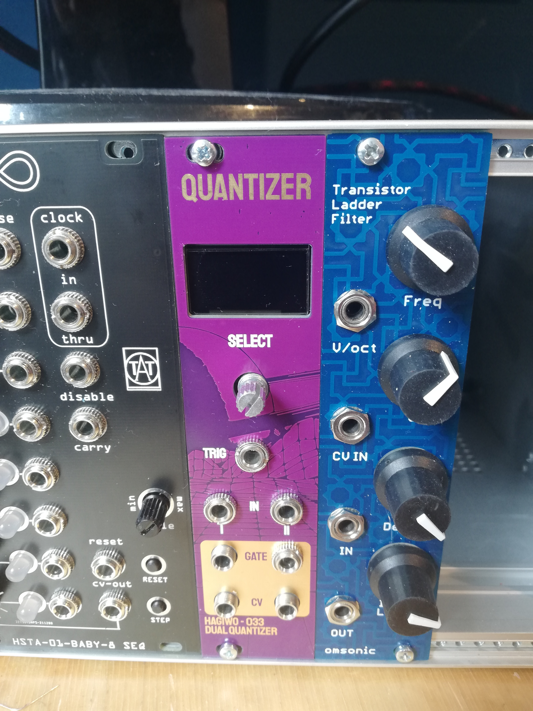
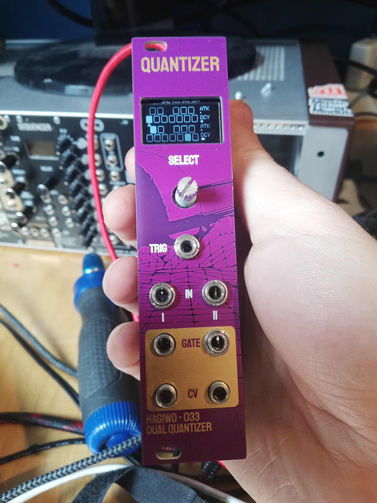
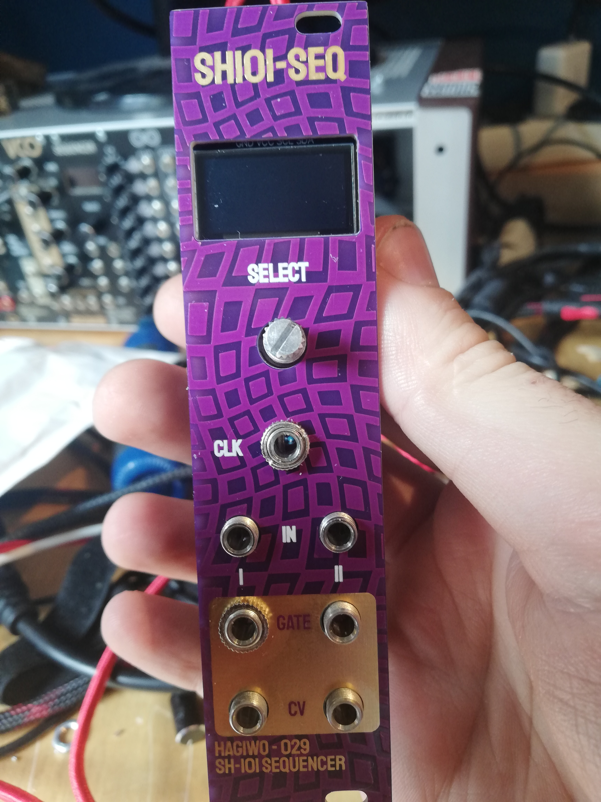
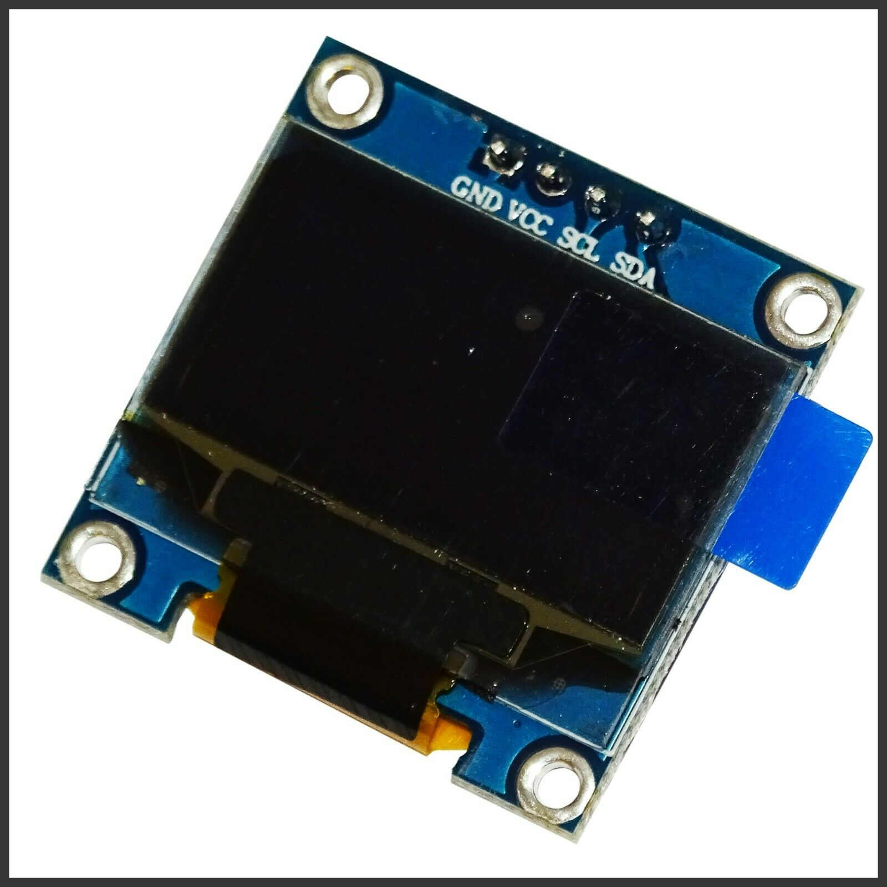

# HAGIWO 029/033 Eurorack Quantizer Module

Through hole PCB version of the [HAGIWO Dual Quantizer](https://www.youtube.com/watch?v=6FJpljEYZq4) and/or [SH101 Sequencer](https://www.youtube.com/watch?v=--qb_QYZrTk) Eurorack Module. The modules uses a seeduino xiao and a mcp4725 dac.

The dual quantizer quantizes to notes selectable on the screen and can automatically trigger an envelope on note changes.
The SH101 sequencer allows recording and playback of cv sequences.

## CURRENT STATE: HARDWARE SHOULD WORK, SOFTWARE NEEDS A FEW MORE DAYS TO COMPLETE SINCE I HAVE ISSUE WITH THE ADC

## Hardsware and PCB

You can find the schematic and BOM in the root folder. For the PCBs, the module has three: main circuit pcb, control pcb and panel. You can order them on any common PCB manufacturing service, I used JLCPCB. Standard settings should be fine. I made them under 100mm if possible to get the discount price.

Currently, the hardware is mostly verified but there are still some software issues to resolve before I will upload the code.

when ordering the display module, make sure to choose an 0.96 I2C oled module that has the pinout specified as GND-VCC-SCL-SDA as opposed to VCC-GND-SCL-SDA (both exist and the latter will fuck it up).    

## Assembly

When assembling, you can either use a header for the screen or solder it directly, as it is a litte too tall.
The 7805 voltage regulator is optional, if you do not want to use it, simply solder the SEL header on the back of the main pcb to BOARD instead of REG (meaning you bridge the connection to choose your 5v voltage source to either be 12 regulated to 5v, or a 5V connection of your rack power if you have it).

